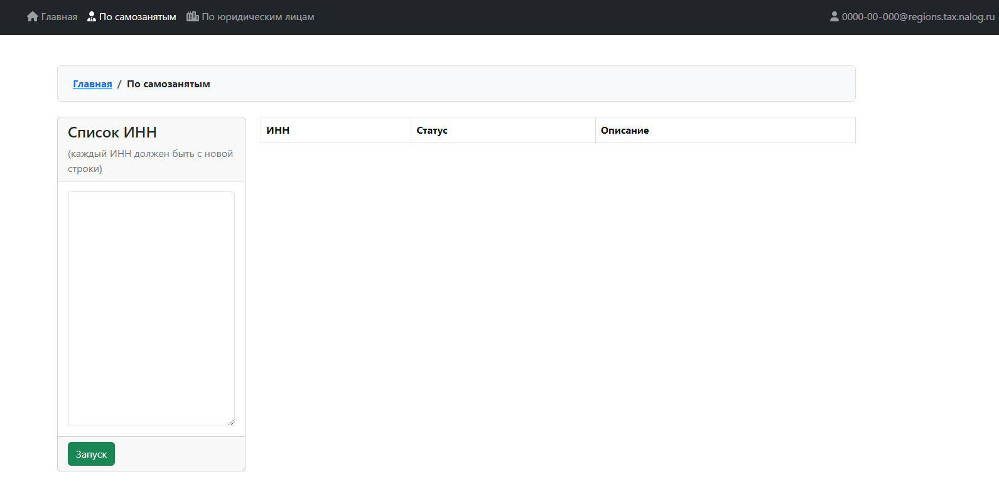
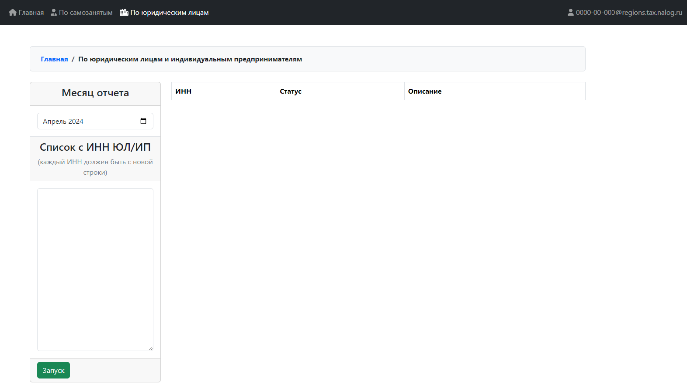

# Приложение по автоматизации сбора информации в ресурсе "МАРМ НДП"

Разработано на основании приложения "16 JWT Authentication & Authorization".

Приложение содержит разделы:
- Главная
- По самозанятым
- По юридическим лицам (индивидуальным предпринимателям)
- Профиль пользователя
- Вход/Выход пользователя

## Главная
На главной странице приведен перечень доступных задач приложения.

## По самозанятым

По списку ИНН выполняется асинхронный поиск информации по самозанятым в ресурсе "МАРМ НПД" ФНС России.

По окончанию работы возможна выгрузка в MS Excel.

## По юридическим лицам и индивидуальным предпринимателям (ЮЛ и ИП)

По списку ИНН выполняется асинхронный поиск информации по юридическому лицу или индивидуальному предпринимателю и привязанным к нему самозанятым (аналогично разделу "По самозанятым") в ресурсе "МАРМ НПД" ФНС России.

По окончанию работы возможна выгрузка в MS Excel.

## Профиль
Отображается информация о текущем сотруднике.

## Вход / выход
Вход и выход пользователя в систему. Аутентификация выполняется с применением токенов (JWT Authentication).

# Настройка
Файл настроек `src/environment.ts`.

